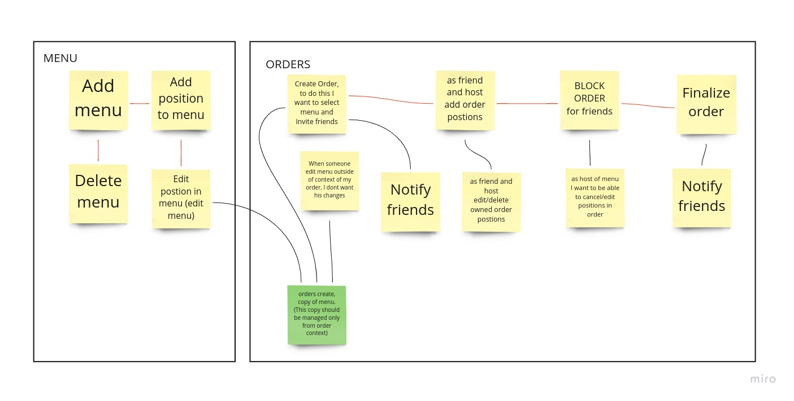

# About project
This example project is just a purposal of usage DDD and CQS on applicaiton layer with python.
Infrastructure layer - IaaC: like AWS, k8s etc and UI are not covered by this project.
Authentication and authorization part also is not covered by this project.

# About Application
## Scenario
I want to order lunch for teammates, eat together, and know how much money and who should give me back.
So I want to open a lunch-event and select the menu of some restaurant from the list. And then I want to add my friends to this event to allow them to select what they want. Then I want to freeze the order , review it, make changes if someone pranked me or made mistake, and then close the order, and got a report with a list of friends with the amount of money of their positions and positions.
My teammates also should get notification how much money they should back.  
## Events / User Stories
\

\
